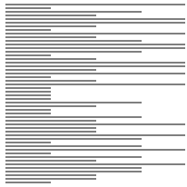
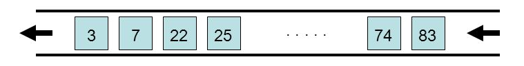
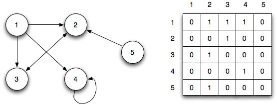
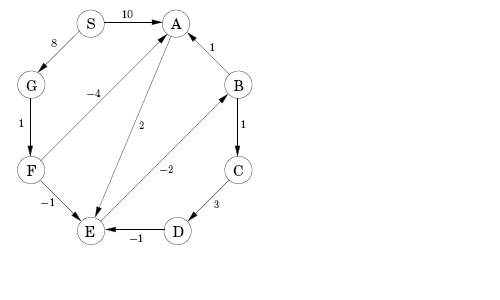
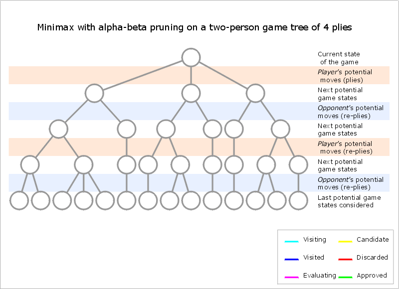
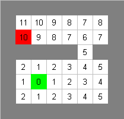

# Java Data Structure Algorithms

Data Structure Algorithms using Java


## Prerequires

1. Git 2.6+
2. Maven 3+
3. Java 8+

## Sorting

* [Bubble](src/main/java/dsa/sort/BubbleSort.java), [Insertion](src/main/java/dsa/sort/InsertionSort.java), [Selection](src/main/java/dsa/sort/SelectionSort.java), [Merge](src/main/java/dsa/sort/MergeSort.java)

	
	
	
	

* [Shell](src/main/java/dsa/sort/ShellSort.java), [Heap](src/main/java/dsa/sort/HeapSort.java), [Quick](src/main/java/dsa/sort/QuickSort.java), [Radix](src/main/java/dsa/sort/RadixSort.java)

	
	
	

## Searching

* [Binary](src/main/java/dsa/search/BinarySearch.java), [Sequential](src/main/java/dsa/search/SequentialSearch.java)

	

## Data Structure

1. Stack

	

	[StackArray](src/main/java/dsa/stack/StackArray.java),
	[StackLinked](src/main/java/dsa/stack/StackLinkedList.java)

2. Queue

	* [Array](src/main/java/dsa/queue/QueueArray.java) or [Linked](src/main/java/dsa/queue/QueueLinkedList.java)

	
	
	* [Minimum](src/main/java/dsa/queue/priority/MinPQ.java) / [Maximum](src/main/java/dsa/queue/priority/MaxPQ.java) Priority Queue

	

3. LinkedList
	
	* [Singly](src/main/java/dsa/list/SinglyLinkedList.java)	 
	
	

	* [Doubly](src/main/java/dsa/list/DoublyLinkedList.java)
	
	
		
	* [Circular](src/main/java/dsa/list/CircularLinkedList.java)

	
	

4. Tree

	* [BinaryTree](src/main/java/dsa/tree/bst/BinarySearchTree.java)


	

	* [AVLTree](src/main/java/dsa/tree/avl/AVLTree.java)


	

	
	* [HuffmanTree](src/main/java/dsa/tree/huffman/HuffmanTree.java)

	
	

5. Graph

	* [Vertex](src/main/java/dsa/graph/Graph.java) or [Adjacent Matrix](src/main/java/dsa/graph/GraphMatrix.java)
	
	

	* [Dijkstra](src/main/java/dsa/ai/graph/path/Dijkstra.java)

	

	* [BellmanFord](src/main/java/dsa/ai/graph/path/BellmanFord.java)

	

	* [Mini Max](src/main/java/dsa/ai/graph/minimax/Minimax.java)

	

	* [AStar](src/main/java/dsa/ai/graph/path/astar/AStar.java)

	


## How to Play

Clone

```
git clone https://github.com/humbertodias/java-data-structures-algorithms.git
```

Inside the folder

```
cd java-data-structures-algorithms
```

Run

```
mvn test
```
```
-------------------------------------------------------
 T E S T S
-------------------------------------------------------
Running dsa.graph.astar.AStarTest
Tests run: 1, Failures: 0, Errors: 0, Skipped: 0, Time elapsed: 0.102 sec
Running dsa.graph.test.BFSTest
Tests run: 1, Failures: 0, Errors: 0, Skipped: 0, Time elapsed: 0.001 sec
Running dsa.graph.test.DFSTest
Tests run: 1, Failures: 0, Errors: 0, Skipped: 0, Time elapsed: 0 sec
Running dsa.graph.test.DijkstraTest
Tests run: 1, Failures: 0, Errors: 0, Skipped: 0, Time elapsed: 0.002 sec
Running dsa.list.test.DoublyLinkedListTest
Tests run: 1, Failures: 0, Errors: 0, Skipped: 0, Time elapsed: 0.006 sec
Running dsa.list.test.SinglyLinkedListTest
Tests run: 1, Failures: 0, Errors: 0, Skipped: 0, Time elapsed: 0.005 sec
Running dsa.queue.test.MaxPQTest
Tests run: 3, Failures: 0, Errors: 0, Skipped: 0, Time elapsed: 0.015 sec
Running dsa.queue.test.MinPQTest
Tests run: 3, Failures: 0, Errors: 0, Skipped: 0, Time elapsed: 0.008 sec
Running dsa.queue.test.QueueArrayTest
Tests run: 3, Failures: 0, Errors: 0, Skipped: 0, Time elapsed: 0.011 sec
Running dsa.stack.test.StackArrayTest
Tests run: 3, Failures: 0, Errors: 0, Skipped: 0, Time elapsed: 0.004 sec
Running dsa.tree.test.BSTTreeTest
Tests run: 4, Failures: 0, Errors: 0, Skipped: 0, Time elapsed: 0.013 sec
Running dsa.tree.test.HuffmanTreeTest
Tests run: 4, Failures: 0, Errors: 0, Skipped: 0, Time elapsed: 0.016 sec

Results :

Tests run: 26, Failures: 0, Errors: 0, Skipped: 0

[INFO] ------------------------------------------------------------------------
[INFO] BUILD SUCCESS
[INFO] ------------------------------------------------------------------------
[INFO] Total time: 2.069 s
[INFO] Finished at: 2016-06-11T18:38:32-03:00
[INFO] Final Memory: 9M/245M
[INFO] ------------------------------------------------------------------------
```


## References

1. [A* Search Algorithm](https://en.wikipedia.org/wiki/A*_search_algorithm)

2. [Dijkstra](http://www.vogella.com/tutorials/JavaAlgorithmsDijkstra/article.html)

3. [BellmanFord](http://www.geekviewpoint.com/java/graph/bellman_ford_shortest_path)

4. [Huffman](https://rosettacode.org/wiki/Huffman_coding#Java)

5. [List](http://java2novice.com/data-structures-in-java/linked-list/doubly-linked-list/)

6. [Stack](http://eddmann.com/posts/implementing-a-stack-in-java-using-arrays-and-linked-lists/)

7. [Sorting](http://www.sorting-algorithms.com/)

8. [Sorting Steps](https://www.bluffton.edu/~nesterd/java/SortingDemo.html)

9. [Radix Sort](https://en.wikipedia.org/wiki/Radix_sort)

10. [Mini Max](http://www.brian-borowski.com/software/connectfour/)